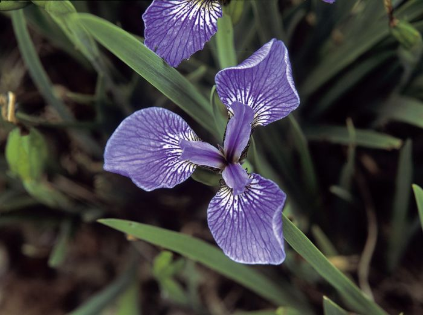
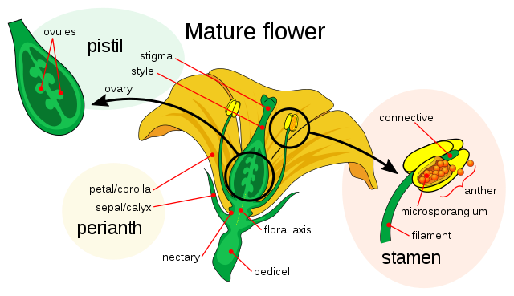

# pands-project

    <h2 align="center">pands-project</h2>
    
This is the repository for the programming and scripting module project - The Iris Dataset

    

<!-- TABLE OF CONTENTS -->
# Table of Contents
1. **[About The Project]("#about-the-project")**
2. **[Getting Started](#getting-Started)**
3. **[Aims](#aims)**
4. **[Research](#research)**
5. **[Methodology](#methodology)**
6. **[Files](#files)**
7. **[Results](#results)**
8. **[Conclusions](#conclusions)**
9. **[References](#references)**

## About The Project

This is the project for the Programming and Scripting module - Higher Diploma in Data Analytics.
Fisher's Iris Data set is to be researched, and documentation (my opinions) and code (Python) must be produced.
Fisher's Iris Data set is also known as the *Iris* flower data set and is a multivariate data set introduced by the 
British statistician and biologist Ronald Fisher in 1936.  

The term *Multivariate* means that multiple variables are in the data set:  
[1] sepal length  
[2] sepal width  
[3] petal length   
[4] petal width  

All the variables are measured in centimetres (cm).

A sepal is the part of a flower that function as protection from a flower in bud, and often as support for the petals when in bloom.

There are three species of Iris in the data set:  
[1] 'Iris Setosa'  
[2] 'Iris Versicolor'  
[3] 'Iris Virginica'

From reading the many blogs and articles written on Fisher's Iris data set, the common theme amongst all of them is the use of the Python or R languages to analysis and identify any patterns.
This pattern is also common for other data analysis projects.
<!--The aim of the project is to use Python to analyse the dataset and identify any patterns within the data, if any.  -->

## Getting Started

I started by creating the Github repository 'pands-project' and added the dataset to it converted from a data file.
The script for conversion is included. As I've characterised the dataset, python scripts have been produced that in turn have generated plots of statistical analysis of the dataset.
Explanations of the files in this repository are below.

## Aims

The task, is to take the dataset and:  
1) Learn why the data is collected in the first place
2) Use Python to learn about the variables within the dataset
3) Explain to others how to identify what type of Iris they have.

## Research

[1] The Mother

I have no background in horticulture - the furthest my expertise extends to is mowing the grass and a small herb garden.
However, my mother is a keen gardener, she told me about a scenario that occurs fairly often with her:
1) She wants to find out what type of plant/tree/flower/etc she's come across
2) She takes a picture and some measurements and any other relevant information (acidity of soil, type of shade, etc.)
3) She then emails RHS (Royal Horticultural Society - she lives in the UK)
4) Within a few days, someone has responded with the answer. 

So there's a *real-life example* of a data set point being checked against a data set (or many) in order to produce an answer. 

[2] The internet - specific links are inluded in the python files and/or in the 'References' section below.  
When one googles 'Iris data set' there's lots of results - Too many for me to examine every single one.

Some have approached the problem from a Machine Learning angle and have applied appropriate libraries in order to develop models, etc so that when a data set of iris species are plugged in, the model can tell you which one it is.

Some have plotted every single histogram/pie chart/scatter plot/etc known to man. 

I have taken neither approach, instead focusing on whether I can find out enough about the three Iris species to explain the differences to colleagues at work and the **minimum most important statistical analysis** that needs to be done in order to do this. The reason for me doing so is that everyone is under time constraints, so they have the option of hearing more (digging deeper into the statistics) or ending the meeting because they feel they know enough.

## Methodology

From all the various articles on data analysis and data visualisation (aimed at beginners in this field) that I've encountered, there's a common pattern:

i) Get the dataset  
ii) Check the dataset for null values and remove them  
iii) Characterise the dataset and associated data - ie How many rows/columns, mean/max/min values etc  
iv) Apply some statistical analysis to get a visual representation of the data  
v) Examine the visual representation - Does it show a pattern or something unique that I can use to understand the data set.  

From the process above, one can take a data set and apply the above steps to look for any unique patterns in the data.

## Files

An explanation of the files in this repository is below:

**converter2.py**  
This pulls directly from the main archive at UCI (University Of California, Irvine) and converts it to a CSV format with headers.
The call to the function is commented out because *analysis.py* calls it.
As a precaution, in case there's any issues with reading from remote machine, I've also included
the file 'iris.data' which is from UCI.
The file does the task of i) from **Methodology**.

**iris2.csv**  
This is the result of converter2.py being run.

**env_var.py**  
This is the script that tells the user what versions of software is installed on the local machine.
The output of this is not printed to analysis.txt as it's only intended to be run if there's something wrong.
If it's run, the output is printed to the terminal.

**EDA.py**  
This is the Exploratory Data Analysis of the Iris Data set. I check for missing values, duplicates, etc.
Descriptive statistics are also generated here so that I can quickly see the following:
- count: (The number of not-empty values)
- mean: (The average (mean)) value
- std: The standard deviation
- min: The minimum value
- 25%: The 25% percentile
- 50%: The 50% percentile
- 75%: The 75% percentile
- max: The maximum value  

The function is called from analysis.py  
This file does the task of ii) and iii) from **Methodology**.

**dataVis.py**  
dataVis.py generates all the visualisations and saves them in the 'Data Visualisation' folder.
The plots saved are '.png' file format.  
Code comments are used to explain what each function does.
This file performs iv) and v) from Preliminary Findings.
I'm examining: 
- Sepal length and width of the species and looking for patterns,
- Petal length and width and looking for patterns,
- Correlation (if any) between any variables so that I might infer what's important when examining the three species.

**analysis.py**  
This calls the functions from the following files so that only one file needs to be run:  
[1] *converter2.py*  
[2] *EDA.py*  
[3] *dataVis.py*  

I've done it in this way because I've split it up into parts and thought if the project scope changed it would be better for maintenance or bug fixing if analysis.py just did the function calls. 
The file is commented with explanations about the functions.

**analysis.txt**  
This is the text file that's required to be generated - All that is contained in the file is text, and is a quick way to get an overview of the dataset. This file is generated from running *analysis.py*

## Folders

There's only three folders, 'Data Visualisation', 'Images' and 'Resources'.
*Images* has two images:
[1] The image you see at the top of this file  
[2] The image in the *About The Project' section to explain what a sepal is.  

*Data Visualisation* is where the all the plots have been saved. I've tried to name them as intuitively as possible, so
that one might look at the name and infer what the plot does.

*Resources* contains a the iris dataset in csv and data formats so that if there's any issue with the user running the script to pull the data remotely than they can change the script and point it to the local copy.

## Results

Examining *analysis.txt* indicates whether I can quickly infer anything about the data set, before looking at plots for visual indications of the statistics.  

*Standard deviation* is the average amount of variability for that score, i.e. how far away it is from the mean.  
It can be seen from the general descriptive statistics at the end of *analysis.txt* that sepal width has the smallest standard deviation and petal length the largest.  

However, when the statistics of each species are examined seperately, it can be seen that:
- 'Iris Setosa' has the smallest deviations in petal length and width but the largest in sepal width.
- 'Iris Virginica' has the largest deviations in sepal length and petal length.
- 'Iris Versicolor' is somewhere inbetween the two in terms of standard deviations of it's features.  

From quickly glancing at the minimum and maximum values of the variables, it can be seen that 'Iris Setosa' is the 
smallest of the three species, whereas with 'Iris Virginica' there seems to be a large variation in how large the plant (flower) can be.

Further progressing from the above results, I now want to start investigating whether a visual representation of the statistics generated from the data can indicate to the layperson any distinguishing features of the three species.

**Box Plots**

A box plot is a type of plot that takes data and shows us the minimum, maximum, median and first and third quartiles. The box plot is included below as a way of visually confirming what was seen in analysis.txt.

  

From looking at the box plots above, it does indeed confirm what was observed about 'Iris Setosa' - that is, it has the smallest deviations in petal length and width and the largest variation in sepal width.  
What can also be observed from the box plots is that 'Iris Setosa' and 'Iris Virginica' are quite seperate to each other in terms of their characteristics - 'Iris Virginica', apart from sepal width, has greater variation across all characteristics.
So from examining the above box plots, it can be inferred that petal length (in cm) is the best variable to distinguish between the species as all the others have overlapping ranges.

**Violin Plots**

Following on from box plots which have shown us the standard deviation, minimum, median and maximum values, we can now use box plots to visually see the frequency distribution of the data. We're doing this to see how the frequency distribution affects the numbers, i.e. are there any outliers that are skewing the data?
The violin plots are overlaid on top of the box plots so that we can have a greater appreciation for the numbers.

From looking at the above plots we can see that 'Iris Setosa' has some outliers when it comes to sepal width and these numbers could potentially be skewing the results. We can also see that 'Iris Virginica' has some outliers around sepal length.

**Histograms**

A histogram is a type of plot that lets us see the frequency distribution (also known as shape) of a set of data.
A histogram is different to a bar chart because the bars are connected to each other, unlike a bar chart for categorical data. 
It can be thought of as a picture of the data and in the histograms below:
- The height of each bar represents the count of each iris (frequency) of that variable

  

Sepal length and sepal width seem to have the only normal distributions whereas petal length and petal width seem 
to have a distribution below the median (known as negatively skewed).

<b>Sepal Relationship</b>

From looking at the scatterplot in the 'Data Visualisation' folder (sepal_length_width.png) we can determine
the following:
'Iris Setosa' has larger sepal widths but smaller sepal lengths
'Iris Virginica' has larger sepal lengths but smaller sepal widths
'Iris Versicolor' is somewhere inbetween the two species in terms of sepal length and width.

<b>Petal Relationship</b>

From looking at the scatterplot in the 'Data Visualisation' folder (petal_length_width.png) we can determine
the following: 
'Iris Setosa' has smaller petal lengths and widths than the other two species
'Iris Virginica' has the largest petal lengths and widths of all three species
'Iris Versicolor' is once again inbetween the two species in terms of petal lengths and widths

<b>Sepal and Petal Relationships</b>  

From looking at the petal vs sepal length (petal_sepal_length.png) and petal vs sepal width (petal_sepal_width.png)
we can see that 'Iris Setosa' is the smallest of the three species and 'Iris Virginica' is the largest, with 'Iris Versicolor' being somewhere inbetween the two in terms of size.
In my opinion, I feel that the above two plots are most important to the layperson or someone (like myself) who knows
nothing about flowers.
You could show anyone the two plots and ask "Which is the smallest?" and "Which is the largest?" and more than likely they would point to 'Iris Setosa' and 'Iris Virginica' respectively.
I believe that, so far, meaning has been extracted from a file, that when opened, just shows numbers and text (iris2.csv)

<b>Pair Plots</b>

'pair_plots.png' is a scatter plot of all pairs of attributes.
If I could only present one plot to my audience, it would be this one, as we can see that petal length and width are highly correlated. In addition, it's clear that no matter what variable is examined, 'Iris Setosa' is clearly apart from the other two species as it has the smallest petal lengths and widths. 'Iris Setosa' also has the smallest sepal 
lengths but wider sepal widths than the other two species.

<b>Potential Limitations</b>
Although the pair plots work well for a data set of this size (150), it's clear that they might not work so well for very large data set sizes for rows that number in the thousands or tens of thousands.

## Conclusion ##  

Petal length is the best variable to distinguish between the three species as confirmed by   
[i] Box plots  
[ii] Scatter plots  
[iii] Pair plots  
For 'Iris Versicolor' there's an overlap at the top of the range (4.5 - 5.2cm) with 'Iris Virginica' as confirmed by the box plot.
Therefore 'Iris Setosa' is the only species that can (visually) be seperated from the other two by using statistics, from looking at analysis.txt we could see that at the very start (statistics for each species at the end of the file).

However, we can further drill down into the petal length variable using Kernel Density Estimation - which is a way to estimate the probability density function of a variable.

Considering the two species 'Iris Versicolor' and 'Iris Virginica', at 4.8cm there's a cross-over between the two species.

The three plots listed above are the ones that I would have in my presentation to colleagues, with possibly the addition of the violin plot overlaid on the box plot to identify any outliers.
I've tried, from the generation of analysis.txt to build open the basic statistics generated and come up with a visual way to present the information. 

## References

**[Fishers Iris data set](https://en.wikipedia.org/wiki/Iris_flower_data_set)**  
**[Maths is fun](https://www.mathsisfun.com/data/standard-deviation.html)**  
**[Statistics and Standard Deviation](https://www.statisticshowto.com/probability-and-statistics/standard-deviation/)**  
**[Choosing the right visualisation techniques for extracting data insights](https://medium.com/analytics-vidhya/choosing-the-right-visualization-techniques-for-extracting-data-insights-34466c9f26e4)**  
**[Pandas describe() method](https://www.w3schools.com/python/pandas/ref_df_describe.asp#:~:text=The%20describe()%20method%20returns,The%20average%20(mean)%20value.)**  
**[Box Plots](https://www.w3schools.com/statistics/statistics_box_plots.php?msclkid=c53adf08c60711ec81a7efa0203468fb)**
**[A Complete Guide to Violin Plots](https://chartio.com/learn/charts/violin-plot-complete-guide/#:~:text=Violin%20plots%20are%20used%20when%20you%20want%20to,to%20see%20where%20groups%20are%20similar%20or%20different.?msclkid=2e64438ec60a11ecbbceb90391cc19fe)**
**[How to fix title being cut off in Seaborn](https://github.com/mwaskom/seaborn/issues/2072)**
**[Kernel Density Estimation (KDE)](https://en.wikipedia.org/wiki/Kernel_density_estimation#:~:text=In%20statistics%2C%20kernel%20density%20estimation,on%20a%20finite%20data%20sample.)**
**[Statistics by Jim](https://statisticsbyjim.com/basics/percentiles/#:~:text=Percentiles%20indicate%20the%20percentage%20of,91%20percent%20of%20other%20scores.)**
**[What is a Sepal?](https://en.wikipedia.org/wiki/Sepal)**
**[Markdown guide](https://www.markdownguide.org/basic-syntax/)**